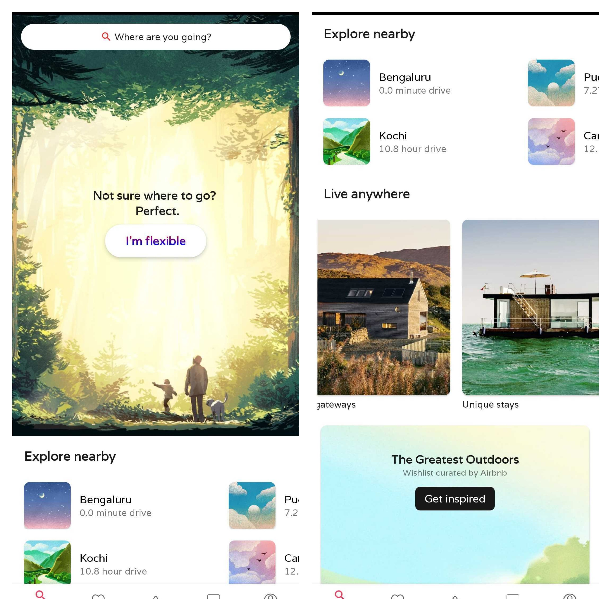
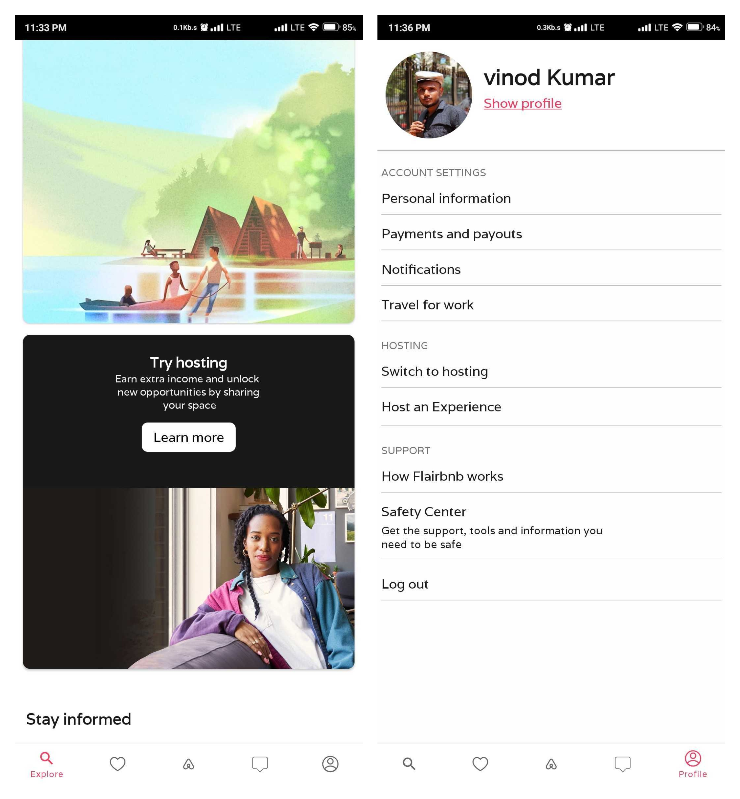
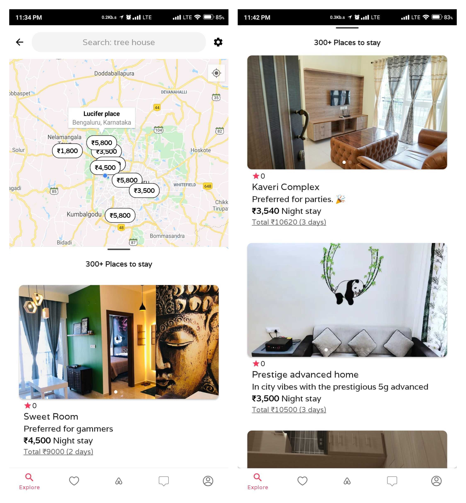
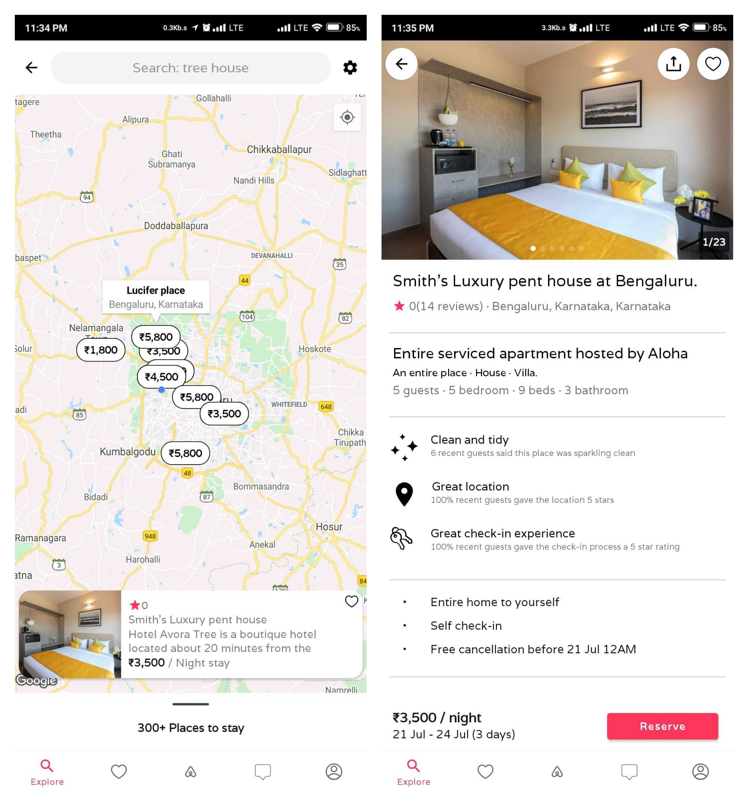
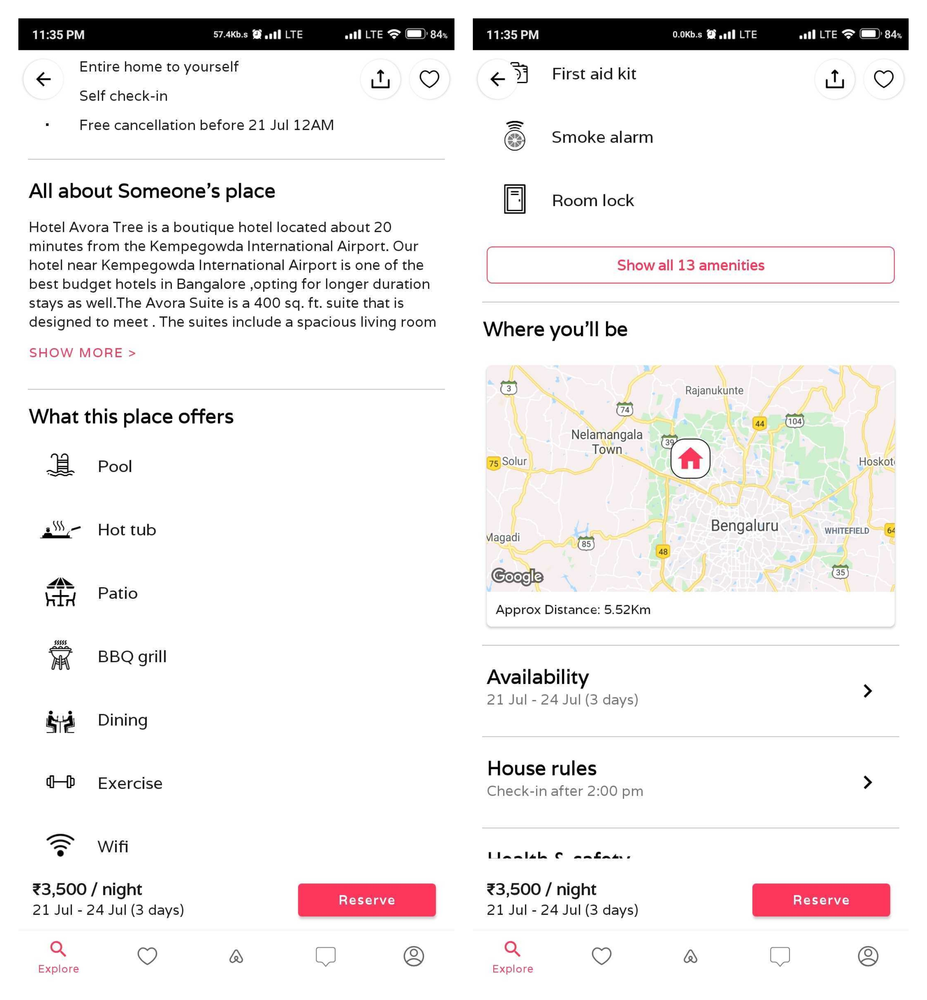
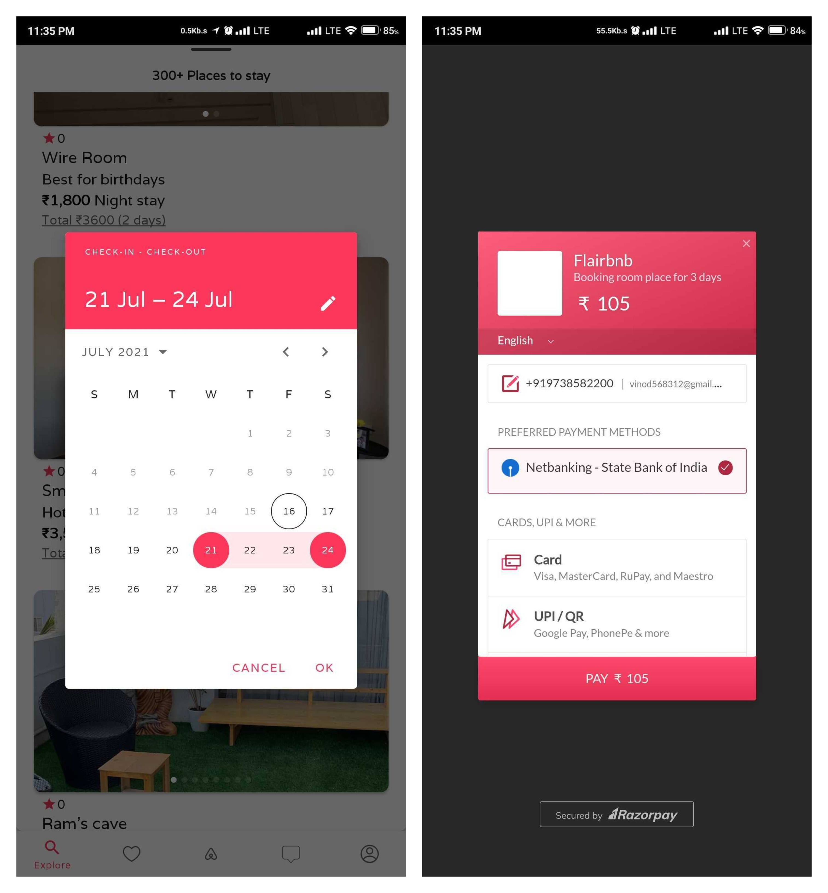
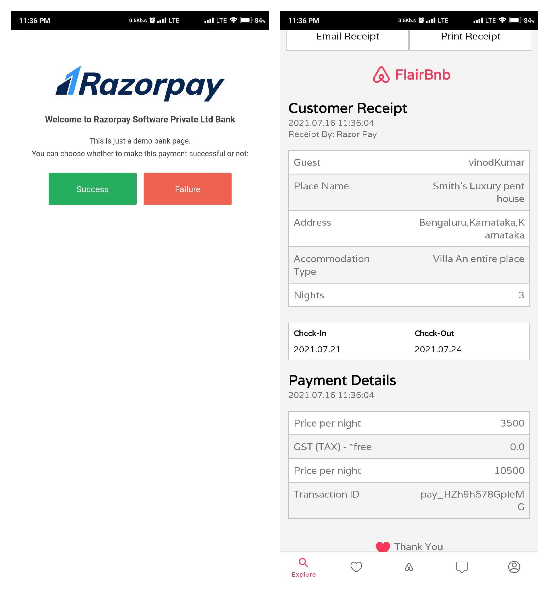

# FlairBnb
<h3>What is FlairBnb??</h3>
<h4>FlairBnb is an exact clone of AirBnb. (wait what!! then what is Airbnb?). Airbnb is an online marketplace that connects people who want to rent out their homes with people who are looking for accommodations in that locale.<h4>

  <h2>App Looks Like</h2>
  

    
    
  

  <h2> TechStacks Used </h2>
  <ul>
    <li>Jetpack Navigations — one Activity, many Fragments.</li>
    <li>Kotlin and Java — used a 9:1 ratio.</li>
    <li>Firebase — for storing real-time data and authentications.</li>
    <li>Firebase Storage — for storing real-time photos.</li>
    <li>GoogleMap Sdk — for place locations. (The Most Difficult Part)</li>
    <li>MVVM Architecture — for better development.</li>
    <li>Dagger Hilt — for simplified dependency injections.</li>
    <li>Material Designs — for the backdrop, buttons, and cards.</li>
  </ul>
  
  <h2> Key Features Included </h2>
  <ul>
    <li>Users can see all the nearby places and book whichever they want.</li>
    <li>Users can host their place to make money.</li>
    <li>Bill exporting to Pdf and Screenshot.</li>
    <li>Secure payment gateway (Razor Pay).</li>
    <li>Very Handy to use.</li>
  </ul>
  
  <h2>Jetpack Navigation Graph</h2>
  

    
  

  
  <h2>Screenshots</h2>
  

    
    
  

  

    
    
  

  

    
    
  

  

    
  

  
  <H3> You can install app or watch the video of completly working app using link below<h3>
  <a href="https://drive.google.com/drive/folders/1wXsMiTvCyniNQ-x758QgtB1DPKdenBOP?usp=sharing">Video</a>
   
  <a href="https://drive.google.com/drive/folders/1wXsMiTvCyniNQ-x758QgtB1DPKdenBOP?usp=sharing">Build Apk</a>
  <H2>Thank You</h2>
